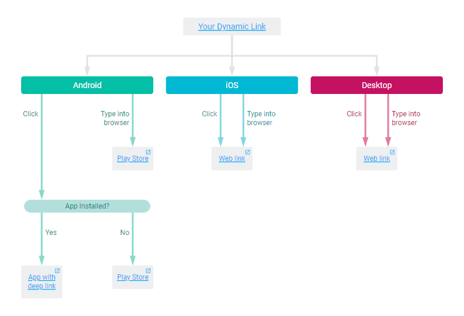

# Firebase Dynamic Links

!!! info "Documentation" 
    https://firebase.google.com/docs/dynamic-links

[`https://mr7f2.app.goo.gl/Tbeh`](https://mr7f2.app.goo.gl/Tbeh){ .md-button }

## Web

Create the link from the [Firebase console](https://console.firebase.google.com/u/0/project/_/durablelinks/creation/).

<figure markdown>
  [](https://mr7f2.app.goo.gl/Tbeh?d=1)
  <figcaption>Click to debug the Firebase Dynamic Link</figcaption>
</figure>

## Android

Same requirements as [App Links](app-links.md).  
And add the Firebase Dynamic Links dependency in the app-level Gradle build file:

```groovy title="app/build.gradle.kts"
implementation platform('com.google.firebase:firebase-bom:<version>')
implementation("com.google.firebase:firebase-dynamic-links-ktx")
```

Then in your `Activity`'s `onCreate` method, use this code to get the link if the user came from a Firebase Dynamic Link:

```kotlin
FirebaseDynamicLinks.getInstance()
    .getDynamicLink(intent)
    .addOnSuccessListener(this) {
        val uri: Uri? = it.link
    }
```

## Data

| Uri | Value |
|---|---|
| scheme | `https` |
| host | `smarquis.fr` |
| path | `/action` |
| query | `?key=value` |
| fragment | `data` |

## Features

| Feature | ✔️/❌ |
|---|:---:|
| App not installed | ✔️ |
| Offline | ❌ |
| Referrer | ❌ |
| Deeplink | ✔️ |
| Deferred deeplink | ✔️ |

## Pros and Cons

➕ Shorten urls https://mr7f2.app.goo.gl/Tbeh?d=1  
➖ Ugly progress dialog when fetching link data  
