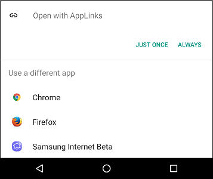
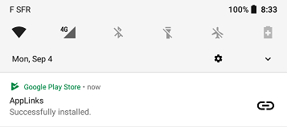
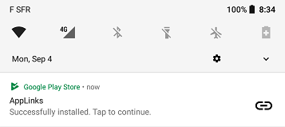
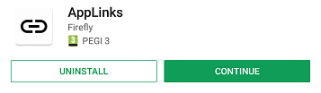

# Android App Linking

> The ultimate developer guide to Android application linking methods

*The main objective of this guide is to explore the most common deeplinking methods on Android and evaluate their pros and cons, through the [AppLinks](https://play.google.com/store/apps/details?id=fr.smarquis.applinks) app.*

<br>

<table>
  <thead>
    <tr><th>Method</th><th>Link</th><th>App not installed</th><th>Offline</th><th><a href="#deeplinking">Deeplink</a></th><th><a href="#referrer-receiver">Referrer</a></th><th><a href="#deferred-deeplink">Deferred deeplink</a></th></tr>
  </thead>
  <tbody>
    <tr align="center"><th align="left"><a href="#web-url">Web url</a></th><td><a href="http://smarquis.fr/action?key=value#data">Test</a></td><td>❌</td><td>✔️</td><td>✔️</td><td>❌</td><td>❌</td></tr>
    <tr align="center"><th align="left"><a href="#app-links">App Links</a></th><td><a href="https://smarquis.fr/action?key=value#data">Test</a></td><td>❌</td><td>✔️</td><td>✔️</td><td>❌</td><td>❌</td></tr>
    <tr align="center"><th align="left"><a href="#custom-scheme">Custom scheme</a></th><td><a href="link://smarquis.fr/action?key=value#data">Test</a></td><td>❌</td><td>✔️</td><td>✔️</td><td>❌</td><td>❌</td></tr>
    <tr align="center"><th align="left"><a href="intent-scheme">Intent scheme</a></th><td><a href="intent://smarquis.fr/action?key=value#data#Intent;scheme=link;package=fr.smarquis.applinks;S.key=value;S.market_referrer=my%20referrer%20data;end">Test</a></td><td>✔️</td><td>✔️</td><td>✔️</td><td>✔️</td><td>❌</td></tr>
    <tr align="center"><th align="left"><a href="#app-scheme">App scheme</a></th><td><a href="android-app://fr.smarquis.applinks/https/smarquis.fr/action?key=value#data#Intent;S.key=value;S.market_referrer=my%20referrer%20data;end">Test</a></td><td>✔️</td><td>✔️</td><td>✔️</td><td>✔️</td><td>❌</td></tr>
    <tr align="center"><th align="left"><a href="#firebase-dynamic-links">Firebase Dynamic Links</a></th><td><a href="https://mr7f2.app.goo.gl/Tbeh">Test</a></td><td>✔️</td><td>❌</td><td>✔️</td><td>❌</td><td>✔️</td></tr>
    <tr align="center"><th align="left"><a href="#market-scheme">Market scheme</a></th><td><a href="market://details?id=fr.smarquis.applinks&url=link%3A%2F%2Fsmarquis.fr%2Faction%3Fkey%3Dvalue%23data&referrer=my%20referrer%20data">Test</a></td><td>✔️</td><td>✔️</td><td>✔️</td><td>✔️</td><td>✔️</td></tr>
    <tr align="center"><th align="left"><a href="#play-store-url">Play Store url</a></th><td><a href="https://play.google.com/store/apps/details?id=fr.smarquis.applinks&url=link%3A%2F%2Fsmarquis.fr%2Faction%3Fkey%3Dvalue%23data&referrer=my%20referrer%20data">Test</a></td><td>✔️</td><td>✔️</td><td>✔️</td><td>✔️</td><td>✔️</td></tr>
  </tbody>
</table>

---

## Web url

> Documentation:  
> https://developer.android.com/training/app-links/deep-linking.html

**`http://smarquis.fr/action?key=value#data`**

### Android

```xml
<activity android:name=".MainActivity">
    <intent-filter>
        <action android:name="android.intent.action.VIEW" />

        <category android:name="android.intent.category.DEFAULT" />
        <category android:name="android.intent.category.BROWSABLE" />

        <data
            android:scheme="http"
            android:host="smarquis.fr"
            android:pathPattern="/action" />
    </intent-filter>
</activity>
```

### Data

| Data | Value |
|---|---|
| scheme | `http` |
| host | `smarquis.fr` |
| path | `action` |
| query | `key=value` |
| fragment | `data` |

### Features

| Feature | ✔️/❌ |
|---|:---:|
| App not installed | ❌ |
| Offline | ✔️ |
| Deeplink | ✔️ |
| Referrer | ❌ |
| Deferred deeplink | ❌ |

### Pros and Cons

Cons:
- Initial disambiguation dialog
- Doesn't work on the same domain
- Some (in-app) browsers might directly handle these links and prevent the app to launch



## App Links

> Documentation:  
> https://developer.android.com/training/app-links/verify-site-associations.html

**`https://smarquis.fr/action?key=value#data`**

A JSON verification file needs to be available at https://smarquis.fr/.well-known/assetlinks.json containing the application's package name and keystore fingerprint

```json
[
    {
        "relation": [
            "delegate_permission/common.handle_all_urls"
        ],
        "target": {
            "namespace": "android_app",
            "package_name": "fr.smarquis.applinks",
            "sha256_cert_fingerprints": [
                "6B:41:26:A6:1E:D8:BD:91:D3:8B:57:10:5F:07:5C:2D:AB:3E:26:A4:D1:3C:9C:97:15:78:9E:0D:56:0A:CE:DC"
            ]
        }
    }
]
```

To test an existing statement file, you can use the official [Statement List Generator and Tester](https://developers.google.com/digital-asset-links/tools/generator) tool.

### Android

Same as [Web url](#web-url) but with `https` only and `android:autoVerify="true"` attribute.  

```xml
<activity android:name=".MainActivity">
    <intent-filter
        android:autoVerify="true"
        tools:targetApi="m">
        <action android:name="android.intent.action.VIEW" />

        <category android:name="android.intent.category.DEFAULT" />
        <category android:name="android.intent.category.BROWSABLE" />
        <data
            android:scheme="https"
            android:host="smarquis.fr"
            android:pathPattern="/action" />
    </intent-filter>
</activity>
```

### Data

| Data | Value |
|---|---|
| scheme | `https` |
| host | `smarquis.fr` |
| path | `action` |
| query | `key=value` |
| fragment | `data` |

### Features

| Feature | ✔️/❌ |
|---|:---:|
| App not installed | ❌ |
| Offline | ✔️ |
| Deeplink | ✔️ |
| Referrer | ❌ |
| Deferred deeplink | ❌ |

### Pros and Cons

Pros:
- No more disambiguation dialog
- No potential app hijacking

Cons:
- Doesn't work on the same domain
- Some (in-app) browsers might directly handle these links and prevent the app to launch

## Custom scheme

> Documentation:  
> https://developer.android.com/training/app-links/deep-linking.html

**`link://smarquis.fr/action?key=value#data`**

### Android

```xml
<activity android:name=".MainActivity">
    <intent-filter>
        <action android:name="android.intent.action.VIEW" />

        <category android:name="android.intent.category.DEFAULT" />
        <category android:name="android.intent.category.BROWSABLE" />

        <data android:scheme="link" />
    </intent-filter>
</activity>
```

### Data
| Data | Value |
|---|---|
| scheme | `link` |
| host | `smarquis.fr` |
| path | `action` |
| query | `key=value` |
| fragment | `data` |

### Features

| Feature | ✔️/❌ |
|---|:---:|
| App not installed | ❌ |
| Offline | ✔️ |
| Deeplink | ✔️ |
| Referrer | ❌ |
| Deferred deeplink | ❌ |

### Pros and Cons

Cons:
- Some browser doesn't handle non-http links

## Intent scheme

> Documentation:  
> https://developer.chrome.com/multidevice/android/intents

**`intent://smarquis.fr/action?key=value#data#Intent;scheme=link;package=fr.smarquis.applinks;S.key=value;S.market_referrer=my%20referrer%20data;end`**

### Web

Extra parameters can be added to the link and will be transfered as extras `Bundle` in the `Intent`:
- String: `S.key=value`
- Boolean: `B.key=value`
- Integer: `i.key=value`
- Long: `l.key=value`
- Float: `f.key=value`

More:
- `S.browser_fallback_url` is the fallback URL if the corresponding link doesn't work of if app isn't available (will be removed from the `Intent`).
- `S.market_referrer` will trigger a `com.android.vending.INSTALL_REFERRER` Broadcast once the app is installed.

### Android

The url will be rewritten by the [parseUri()](https://android.googlesource.com/platform/frameworks/base/+/refs/heads/master/core/java/android/content/Intent.java#5831) method from the Android source code.  
The new url will be `link://smarquis.fr/action?key=value#data`

And will contain additional parameters in the `Intent`.  

### Data

| Data | Value |
|---|---|
| scheme | `link` |
| host | `smarquis.fr` |
| path | `action` |
| query | `key=value` |
| referrer | `my%20referrer%20data` |
| extras | String `key`:`value` |

### Features

| Feature | ✔️/❌ |
|---|:---:|
| App not installed | ✔️ |
| Offline | ✔️ |
| Deeplink | ✔️ |
| Referrer | ✔️ |
| Deferred deeplink | ❌ |

### Pros and Cons

Cons:
- Some browser doesn't handle non-http links

## App scheme

> Documentation:  
> https://developer.android.com/reference/android/content/Intent.html#URI_ANDROID_APP_SCHEME

**`android-app://fr.smarquis.applinks/https/smarquis.fr/action?key=value#data#Intent;S.key=value;S.market_referrer=my%20referrer%20data;end`**

Very similar to [Intent scheme](#intent-scheme).

### Web

Extra parameters can be added to the link and will be transfered as extras `Bundle` in the `Intent`:
- String: `S.key=value`
- Boolean: `B.key=value`
- Integer: `i.key=value`
- Long: `l.key=value`
- Float: `f.key=value`

More:
- `S.market_referrer` will trigger a `com.android.vending.INSTALL_REFERRER` Broadcast once the app is installed.

### Android

The url will be rewritten by the [parseUri()](https://android.googlesource.com/platform/frameworks/base/+/refs/heads/master/core/java/android/content/Intent.java#5831) method from the Android source code.  
The new url will be `https://smarquis.fr/action?key=value#data`

And will contain additional parameters in the `Intent`.  

### Data

| Data | Value |
|---|---|
| scheme | `https` |
| host | `smarquis.fr` |
| path | `action` |
| query | `key=value` |
| referrer | `my%20referrer%20data` |
| extras | String `key`:`value` |

### Features

| Feature | ✔️/❌ |
|---|:---:|
| App not installed | ✔️ |
| Offline | ✔️ |
| Deeplink | ✔️ |
| Referrer | ✔️ |
| Deferred deeplink | ❌ |

### Pros and Cons

Cons:
- Only handled by the Google Search app
- Some browser doesn't handle non-http links

## Firebase Dynamic Links

> Documentation:  
> https://firebase.google.com/docs/dynamic-links

**`https://mr7f2.app.goo.gl/Tbeh`**

### Web

Create the link from the Firebase console.

### Android

Same requirements as [App Links](#app-links).  
And add the Firebase Dynamic Links dependency in the app-level `build.gradle` file:

```groovy
compile 'com.google.firebase:firebase-invites:11.2.0'
```

Then in your `Activity`'s `onCreate` method, use this code to get the link if the user came from a Firebase Dynamic Link:
```java
FirebaseDynamicLinks.getInstance()
        .getDynamicLink(getIntent())
        .addOnSuccessListener(this, new OnSuccessListener<PendingDynamicLinkData>() {
            @Override
            public void onSuccess(PendingDynamicLinkData pendingDynamicLinkData) {
                if (pendingDynamicLinkData != null) {
                    Uri link = pendingDynamicLinkData.getLink();
                }
            }
        });
```

### Data

| Data | Value |
|---|---|
| scheme | `https` |
| host | `smarquis.fr` |
| path | `action` |
| query | `key=value` |
| referrer | `utm_source=(not%20set)&utm_medium=(not%20set)` |

### Features

| Feature | ✔️/❌ |
|---|:---:|
| App not installed | ✔️ |
| Offline | ❌ |
| Deeplink | ✔️ |
| Referrer | ❌ |
| Deferred deeplink | ✔️ |

### Pros and Cons

Pros:
- Shorten urls https://mr7f2.app.goo.gl/Tbeh?d=1

Cons:
- Ugly progress dialog when fetching link data
- Wrong referrer

## Market scheme

> Documentation:  
> https://developer.android.com/distribute/marketing-tools/linking-to-google-play.html#UriSummary

**`market://details?id=fr.smarquis.applinks&url=link%3A%2F%2Fsmarquis.fr%2Faction%3Fkey%3Dvalue%23data&referrer=my%20referrer%20data`**

### Web

This url contains additional query parameters that will be handled by the Play Store app:
- `url` is the forwarded url
- `referrer` will trigger a `com.android.vending.INSTALL_REFERRER` Broadcast once the app is installed.

### Android

The url will be rewritten by the Play Store to `link://smarquis.fr/action?key=value#data`

### Data

| Data | Value |
|---|---|
| scheme | `link` |
| host | `smarquis.fr` |
| path | `action` |
| query | `key=value` |
| referrer | `my%20referrer%20data` |

### Features

| Feature | ✔️/❌ |
|---|:---:|
| App not installed | ✔️ |
| Offline | ✔️ |
| Deeplink | ✔️ |
| Referrer | ✔️ |
| Deferred deeplink | ✔️ |

### Pros and Cons

Pros:
- Changes the "Open" button in Play Store to "Continue"
- Triggers a notification with "Tap to continue"

## Play Store url

> Documentation:  
> https://developer.android.com/distribute/marketing-tools/linking-to-google-play.html#UriSummary

**`https://play.google.com/store/apps/details?id=fr.smarquis.applinks&url=link%3A%2F%2Fsmarquis.fr%2Faction%3Fkey%3Dvalue%23data&referrer=my%20referrer%20data`**

Very similar to the [Market scheme](#market-scheme).

### Web

This url contains additional query parameters that will be handled by the Play Store app:
- `url` is the forwarded url
- `referrer` will trigger a `com.android.vending.INSTALL_REFERRER` Broadcast once the app is installed.

### Android

The url will be rewritten by the Play Store to `link://smarquis.fr/action?key=value#data`

### Data

| Data | Value |
|---|---|
| scheme | `link` |
| host | `smarquis.fr` |
| path | `action` |
| query | `key=value` |
| referrer | `my%20referrer%20data` |

### Features

| Feature | ✔️/❌ |
|---|:---:|
| App not installed | ✔️ |
| Offline | ✔️ |
| Deeplink | ✔️ |
| Referrer | ✔️ |
| Deferred deeplink | ✔️ |

### Pros and Cons

Cons:
- Some (in-app) browsers might directly handle these links and prevent the app to launch

Pros:
- Changes the "Open" button in Play Store to "Continue"
- Triggers a notification with "Tap to continue"

## More

### Deeplinking

You can get the deeplink `Uri` in your `Activity`'s `onCreate()` method as well as the corresponding properties:

```java
@Override
protected void onCreate(@Nullable Bundle savedInstanceState) {
    super.onCreate(savedInstanceState);
    Uri deeplink = getIntent().getData();
    if (deeplink != null) {
        String host = deeplink.getHost();
        String path = deeplink.getPath();
        String query = deeplink.getQuery();
        String fragment = deeplink.getFragment();
    }
}
```

### Deferred deeplink

When using [Play Store url](#play-store-url) or [Market scheme](#market-scheme) or [Firebase Dynamic Links](#firebase-dynamic-links) methods, the regular Play Store **Open** button will be replaced by a **Continue** button.  
Furthermore, a notification will be displayed with **Tap to continue** content.  
These two actions are essential to the Deferred deeplink method as they provide the initial data to the app.  

| Regular Deeplink | Deferred Deeplink |
|---|---|
|  |  |
|  |  |

### Referrer Receiver

Add the Broadcast Receiver in `AndroidManifest.xml`

```xml
<receiver
    android:name=".ReferrerReceiver"
    android:exported="true">
    <intent-filter>
        <action android:name="com.android.vending.INSTALL_REFERRER" />
    </intent-filter>
</receiver>
```

And in the Receiver's `onReceive()` method, you can get the referrer value

```java
@Override
public void onReceive(Context context, Intent intent) {
    String referrer = intent.getExtras().getString("referrer");
}
```

### Url redirections

- HTML regular `href` link
  ```html
  <a href="${link}">Click here</a>
  ```
- Javascript manual redirect
  ```javascript
  window.location = "${link}";
  ```
- Javascript automatic redirect
  ```javascript
  window.onload = function() {
    window.location.replace("${link}");
  };
  ```
- Server 3XX redirection (php, nginx, etc.)
  ```php
  header("Location: ${link}");
  ```

### Adb Activity Manager

To try links with adb, use the Activity Manager (am) command:

```shell
$ adb shell 'am start "link://smarquis.fr/action?key=value#data"'
```

### Alternatives

- [Branch](https://branch.io/)
- [HOKO](https://hokolinks.com)
- [Yozio](http://www.yozio.com)
- [Tapstream](https://tapstream.com/onboarding-links)

<br>

---

<small><a href="mailto:contact@simon-marquis.fr">© Simon Marquis</a></small>
