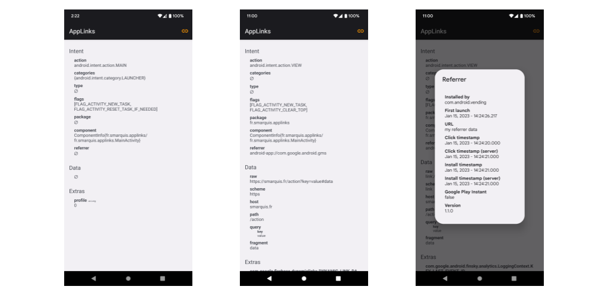

# Android App Linking

> The ultimate developer guide to Android application linking methods

*The main objectives of this guide are to explore the most common deeplinking methods available on Android and evaluate their pros and cons.*  
*The source code of the [AppLinks](https://play.google.com/store/apps/details?id=fr.smarquis.applinks) Android app is available on the corresponding [GitHub repository](https://github.com/SimonMarquis/Android-App-Linking).*

| Method | Link | App not installed | Offline | [Referrer][misc/referrer-receiver] | [Deeplink][misc/deeplinking] | [Deferred deeplink][misc/deferred-deeplink] |
|---|---|---|---|---|---|---|
| **[Web url](web-url.md)** | [Test][test-web-url] | ❌ | ✔️ | ❌ | ✔️ | ❌ |
| **[App Links](app-links.md)** | [Test][test-app-links] | ❌ | ✔️ | ❌ | ✔️ | ❌ |
| **[Custom scheme](custom-scheme.md)** | [Test][test-custom-scheme] | ❌ | ✔️ | ❌ | ✔️ | ❌ |
| **[Intent scheme](intent-scheme.md)** | [Test][test-intent-scheme] | ✔️ | ✔️ | ✔️ | ✔️ | ❌ |
| **[App scheme](app-scheme.md)** | [Test][test-app-scheme] | ✔️ | ✔️ | ✔️ | ✔️ | ❌ |
| **[Firebase Dynamic Links](firebase-dynamic-links.md)** | [Test][test-firebase-dynamic-links] | ✔️ | ❌ | ❌ | ✔️ | ✔️ |
| **[Play Store url](play-store-url.md)** | [Test][test-play-store-url] | ✔️ | ✔️ | ✔️ | ❌ | ✔️ |
| **[Market scheme](market-scheme.md)** | [Test][test-market-scheme] | ✔️ | ✔️ | ✔️ | ✔️ | ✔️ |

[test-web-url]: http://smarquis.fr/action?key=value#data
[test-app-links]: https://smarquis.fr/action?key=value#data
[test-custom-scheme]: link://smarquis.fr/action?key=value#data
[test-intent-scheme]: intent://smarquis.fr/action?key=value#data#Intent;scheme=link;package=fr.smarquis.applinks;S.key=value;S.market_referrer=my%20referrer%20data;end
[test-app-scheme]: android-app://fr.smarquis.applinks/https/smarquis.fr/action?key=value#data#Intent;S.key=value;S.market_referrer=my%20referrer%20data;end
[test-firebase-dynamic-links]: https://mr7f2.app.goo.gl/Tbeh
[test-play-store-url]: https://play.google.com/store/apps/details?id=fr.smarquis.applinks&url=link%3A%2F%2Fsmarquis.fr%2Faction%3Fkey%3Dvalue%23data&referrer=my%20referrer%20data
[test-market-scheme]: market://details?id=fr.smarquis.applinks&url=link%3A%2F%2Fsmarquis.fr%2Faction%3Fkey%3Dvalue%23data&referrer=my%20referrer%20data

[misc/referrer-receiver]: misc.md#referrer-receiver
[misc/deeplinking]: misc.md#deeplinking
[misc/deferred-deeplink]: misc.md#deferred-deeplink
