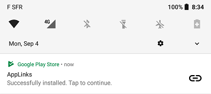

# Misc

## Referrer Receiver

Add the Broadcast Receiver in `AndroidManifest.xml`

```xml title="AndroidManifest.xml"
<receiver
    android:name=".ReferrerReceiver"
    android:exported="true">
    <intent-filter>
        <action android:name="com.android.vending.INSTALL_REFERRER" />
    </intent-filter>
</receiver>
```

And in the Receiver's `onReceive()` method, you can get the referrer value

```kotlin title="ReferrerReceiver.kt"
class ReferrerReceiver : BroadcastReceiver() {
    override fun onReceive(context: Context, intent: Intent) {
        val referrer: String? = referrer = intent.extras.getString("referrer")
    }
}
```

## Deeplinking

You can get the deeplink `Uri` in your `Activity`'s `onCreate()` method as well as the corresponding properties:

```kotlin title="MainActivity.kt"
override fun onCreate(savedInstanceState: Bundle?) {
    super.onCreate(savedInstanceState)
    val deeplink = intent.data
    if (deeplink != null) {
        val host = deeplink.host
        val path = deeplink.path
        val query = deeplink.query
        val fragment = deeplink.fragment
    }
}
```

## Deferred deeplink

When using [Play Store url](play-store-url.md) or [Market scheme](market-scheme.md) or [Firebase Dynamic Links](firebase-dynamic-links.md) methods, the regular Play Store **Open** button will be replaced by a **Continue** button.  
Furthermore, a notification will be displayed with **Tap to continue** content.  
These two actions are essential to the Deferred deeplink method as they provide the initial data to the app.  

| Regular Deeplink | Deferred Deeplink |
|---|---|
|  |  |
|  |  |

## Url redirections

- HTML regular `href` link
  ```html
  <a href="${link}">Click here</a>
  ```
- Javascript manual redirect
  ```javascript
  window.location = "${link}";
  ```
- Javascript automatic redirect
  ```javascript
  window.onload = function() {
    window.location.replace("${link}");
  };
  ```
- Server 3XX redirection (php, nginx, etc.)
  ```php
  header("Location: ${link}");
  ```

## Adb Activity Manager

To try links with adb, use the Activity Manager (am) command:

```shell
$ adb shell 'am start "link://smarquis.fr/action?key=value#data"'
```

## Alternatives

- [Branch](https://branch.io/)
- [HOKO](https://hokolinks.com)
- [Yozio](http://www.yozio.com)
- [Tapstream](https://tapstream.com/onboarding-links)
