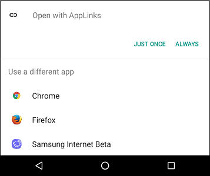

# Web url

!!! info "Documentation"
    https://developer.android.com/training/app-links/deep-linking.html

[`http://smarquis.fr/action?key=value#data`](http://smarquis.fr/action?key=value#data){ .md-button }

## Android

```xml title="AndroidManifest.xml"
<activity android:name=".MainActivity">
    <intent-filter>
        <action android:name="android.intent.action.VIEW" />

        <category android:name="android.intent.category.DEFAULT" />
        <category android:name="android.intent.category.BROWSABLE" />

        <data
            android:scheme="http"
            android:host="smarquis.fr"
            android:pathPattern="/action" />
    </intent-filter>
</activity>
```

## Data

| Uri | Value |
|---|---|
| scheme | `http` |
| host | `smarquis.fr` |
| path | `/action` |
| query | `?key=value` |
| fragment | `data` |

## Features

| Feature | ✔️/❌ |
|---|:---:|
| App not installed | ❌ |
| Offline | ✔️ |
| Referrer | ❌ |
| Deeplink | ✔️ |
| Deferred deeplink | ❌ |

## Pros and Cons

➖ Initial disambiguation dialog  
➖ Doesn't work on the same domain  
➖ Some (in-app) browsers might directly handle these links and prevent the app to launch  


